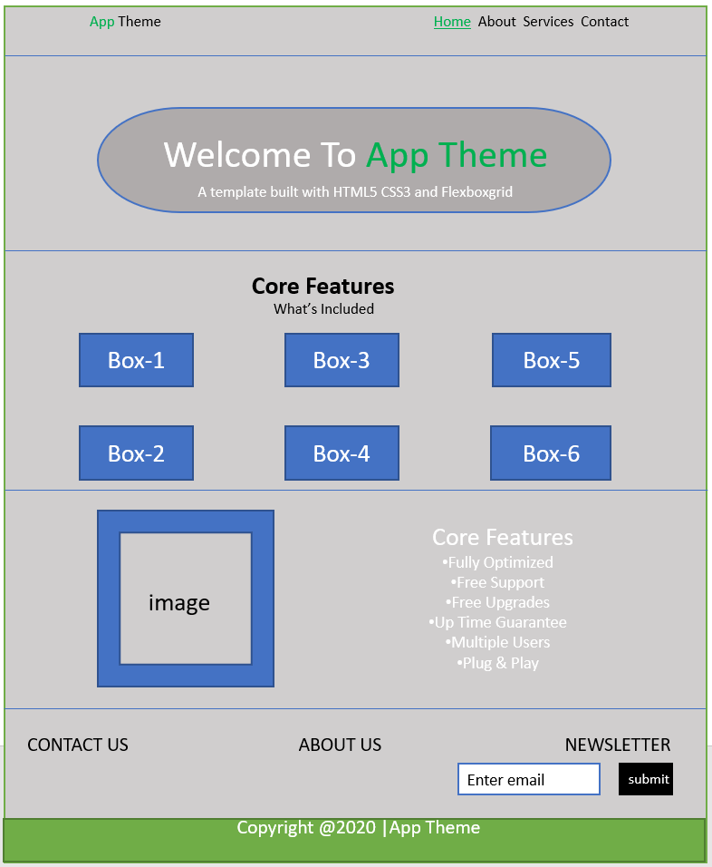

# Development Strategy

> `APP-THEME`

write a short description of your project:
- who would want to use it?
- why would they want to use it?

## Wireframe

<!-- include a wireframe for your project in this repository, and display it here -->
<!-- wireframe.cc is a good site for getting started with wireframes -->

## 0. Set-Up

__A User can see my initial repository and live demo__

### Repo

- Generate from Template
- Write initial, basic README
- Turn on GitHub Pages
- Write the development strategy
- Adding wireframes into development strategy.

## STEP-1
> branch name : 1-index

### Repo
In this step, index.html page of the website is added. Two folders css and images are created.

### HTML
- create `main-header` and `nav-bar`
- create the `show case` section
- create the `features` section
- create the `info` section
- create the `company` section
- create the `main-footer`
### CSS

- create `body` styling
- set the `img` width 100%
- set `container` margin to `auto`
- create the styling for `main-header` `navbar` `showcase` 
`features` `info` `comapny` and `main-footer`
- create the `flexboxgrid.css`
## STEP-2
> branch name: 2-about
### Repo
In this step about.html the second page of website is created.

### HTML
- add `main-header` and `nav-bar`

- create the `subheader` section
- create the `page` section
- create the `company` section
- add the `main-footer`

### CSS

- create the styling for `subheader`  `page` `comapny`

## STEP-3
> branch name: 3-services
### Repo
In this step services.html the third page of website is created.

### HTML
- add `main-header` and `nav-bar`

- create the `subheader` section
- create the `page` section
- create the `company` section
- add the `main-footer`

### CSS

- create the styling for `subheader`  `page` `comapny`

## STEP-4
> branch name: 4-contact
### Repo
In this step contact.html the fourth page of website is created.

### HTML
- add `main-header` and `nav-bar`

- create the `subheader` section
- create the `page` section and add the form
- create the `company` section
- add the `main-footer`

### CSS

- create the styling for `subheader`  `page`and create a form with input and buttons `comapany`

## STEP-5
> branch name: 5-responsive
### Repo
In this step responsive web design is added

### CSS

media queries are added.
- 

## Finishing Touches

